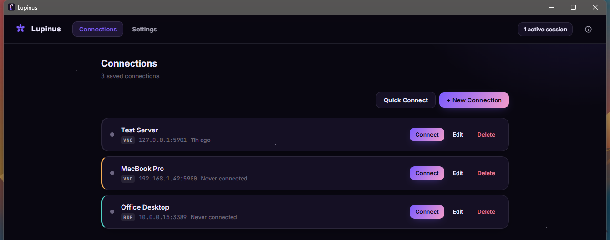
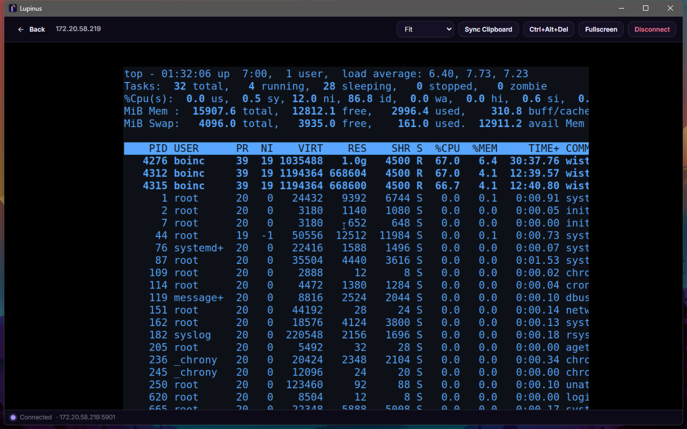

# Lupinus

Native cross-platform VNC + RDP client.

**Website:** <https://alplix.github.io/lupinus/> (available in 38 languages) ·
**Download:** [latest release](https://github.com/alplix/lupinus/releases/latest)

Lupinus connects to VNC and RDP servers and gives you a fast, native-feeling remote desktop
viewer — no browser tab, no Electron, just a small native window built with
**Go + [Wails v2](https://wails.io)**.

<p align="center">
  <br>
  
</p>

## Features

| Area | What you can do |
|---|---|
| **Protocols** | VNC (RFB 3.3 / 3.7 / 3.8) and RDP, from one app |
| **VNC security** | None, VNC Authentication, and Apple Remote Desktop (username + password) — which is what macOS Screen Sharing uses |
| **VNC encodings** | Raw, CopyRect, ZRLE and Tight (with JPEG), plus DesktopSize and Cursor pseudo-encodings |
| **RDP** | TLS with trust-on-first-use certificate pinning, NLA / CredSSP sign-in, GDI drawing orders, two-way clipboard |
| **Slow links** | Colour depth (32 / 16 / 8-bit) tunes itself to the connection, only changed pixels reach the viewer, and pointer traffic is coalesced — see [Adaptive quality](#adaptive-quality) |
| **Sessions** | Several sessions open at once, automatic reconnect after a dropped connection |
| **Saved connections** | Name, host, port, username and colour tag stored locally, with import / export. Passwords never touch disk — they live in the OS keychain (Windows Credential Manager, macOS Keychain, Linux Secret Service) |
| **Live viewer** | Fit / actual-size / stretch scaling that follows window resizes, two-way clipboard, full keyboard and pointer passthrough, Ctrl+Alt+Del |
| **Languages** | 38 UI languages (including right-to-left scripts), chosen from the OS locale or in Settings |
| **Theme** | Light and dark |

### Adaptive quality

Some servers — macOS Screen Sharing above all — answer the smallest change with a full-screen,
lossless frame (5+ MB at Retina resolution). Over the internet that used to make a session
unusable, so Lupinus adapts on its own: it measures the link, picks the best of 32 / 16 / 8-bit
colour whose full-screen frame fits a time budget, and climbs back up when the link recovers.
Settings → *VNC quality* only picks how aggressive that is (*High quality* pins 32-bit colour).

## Platforms

Every release is built by GitHub Actions and published with `SHA256SUMS.txt`.

| OS | Architectures | Packaging | Notes |
|---|---|---|---|
| Windows 10/11 | x64, ARM64 | NSIS installer + portable zip | WebView2 required at runtime (bundled by the installer) |
| Windows | 32-bit (x86) | portable zip | no installer for 32-bit |
| macOS | universal (Intel + Apple silicon) | `.app` bundle (zip) | |
| Linux | x64, ARM64, ARM 32-bit | portable `.tar.gz` | GTK3 + WebKitGTK 4.1 required |

## Getting started

1. Open **New Connection**, pick VNC or RDP, and enter the server's host and port (`5900` for VNC,
   `3389` for RDP). For a Mac, turn on *Screen Sharing* in System Settings and sign in with your Mac
   username and password.
2. Save it to reuse later — Lupinus stores the password in your OS keychain, never in a plaintext
   config file — or just **Quick Connect** without saving anything.
3. Once connected, use the viewer toolbar to switch scaling modes, sync your clipboard, send
   Ctrl+Alt+Del, or switch theme.

Connection metadata is stored in the OS config directory (`~/.config/lupinus` on Linux,
`%APPDATA%\lupinus` on Windows, `~/Library/Application Support/lupinus` on macOS).

## Building from source

Prerequisites:

- Go 1.26+
- [Wails CLI](https://wails.io/docs/gettingstarted/installation) (`go install github.com/wailsapp/wails/v2/cmd/wails@latest`)
- Node.js 20+ (frontend tooling)

On Linux you also need the [Wails WebKit/GTK dependencies](https://wails.io/docs/guides/linux)
(`libgtk-3-dev libwebkit2gtk-4.1-dev libayatana-appindicator3-dev`). On Windows,
[WebView2](https://developer.microsoft.com/microsoft-edge/webview2/) is required at runtime
(bundled by the installer).

```
wails dev     # live development build
wails build   # production build for the current platform
```

Cross-compiling for release targets is handled by the CI pipelines:

- `.github/workflows/ci.yml` — version-sync check, vet, tests and a Linux smoke build on every PR/push
- `.github/workflows/release.yml` — tagged releases (`vX.Y.Z`) for Windows (x64, ARM64, 32-bit),
  macOS (universal) and Linux (x64, ARM64, ARM 32-bit) with checksums

### Manual cross-build example (Linux host)

```bash
# Windows amd64 (+ NSIS installer)
wails build -platform windows/amd64 -nsis -webview2 download

# Linux arm64
wails build -platform linux/arm64
```

## Architecture

```
frontend/                 Vite + vanilla JS/CSS single-page UI
  src/viewer.js            canvas rendering, scaling, input capture, clipboard bridge
  src/keysym.js             DOM KeyboardEvent -> X11 keysym mapping
  wailsjs/                  generated bindings to the Go API

internal/rfb/               RFB client: handshake, VNC/Apple auth, Raw/CopyRect/ZRLE/Tight decoding, adaptive colour depth
internal/rdp/               RDP client: TLS + NLA/CredSSP, bitmap/GDI decoding, clipboard
internal/store/              connections, settings, pinned certificates; passwords in the OS keyring
internal/wsbridge/           local WebSocket bridge carrying framebuffer/input between Go and the webview
docs/                        the project website (GitHub Pages) and its 38 translations
internal/version/            single source of truth for the version number and branding strings
app.go                       Wails-bound API surface (connections, live sessions, settings)
main.go                      tray icon + window lifecycle, single-instance lock
```

## Releasing

`internal/version/version.go`'s `Version` constant is the **single source of truth** for the
Lupinus version number — unlike some older sibling projects that hand-edit the version in three
different places, everything else is derived from it.

1. Bump `Version` in `internal/version/version.go`.
2. Run `node scripts/sync-version.mjs` — it stamps `wails.json`'s `info.productVersion` and
   `frontend/package.json`'s `version` to match, and prints what it changed. CI re-runs this
   script and fails the build if anything is out of sync, so don't skip it.
3. Commit the changes.
4. `git tag vX.Y.Z && git push origin vX.Y.Z` — this triggers `release.yml`, which builds every
   platform and publishes a GitHub release with `SHA256SUMS.txt` alongside the archives.

## Roadmap

Not yet implemented — contributions welcome:

- Hextile encoding and VeNCrypt / TLS for VNC
- File transfer
- Multi-monitor / multi-display sessions
- Audio redirection

## Website

The landing page lives in [`docs/`](docs) (plain HTML/CSS/JS, no build step) and is served by
GitHub Pages. Translations are one small JSON file per language in
[`docs/i18n/`](docs/i18n) — copy `en.json`, translate the values, and add the language code to
the list in `docs/site.js`. The app's own strings are in `frontend/src/locales/`.

## Author

**Coded by Alperen Yavuz**

## Support

If Lupinus is useful to you and you'd like to support its development:

[Support Lupinus](https://coff.ee/alplix)

## License

MIT — see [LICENSE](LICENSE).
